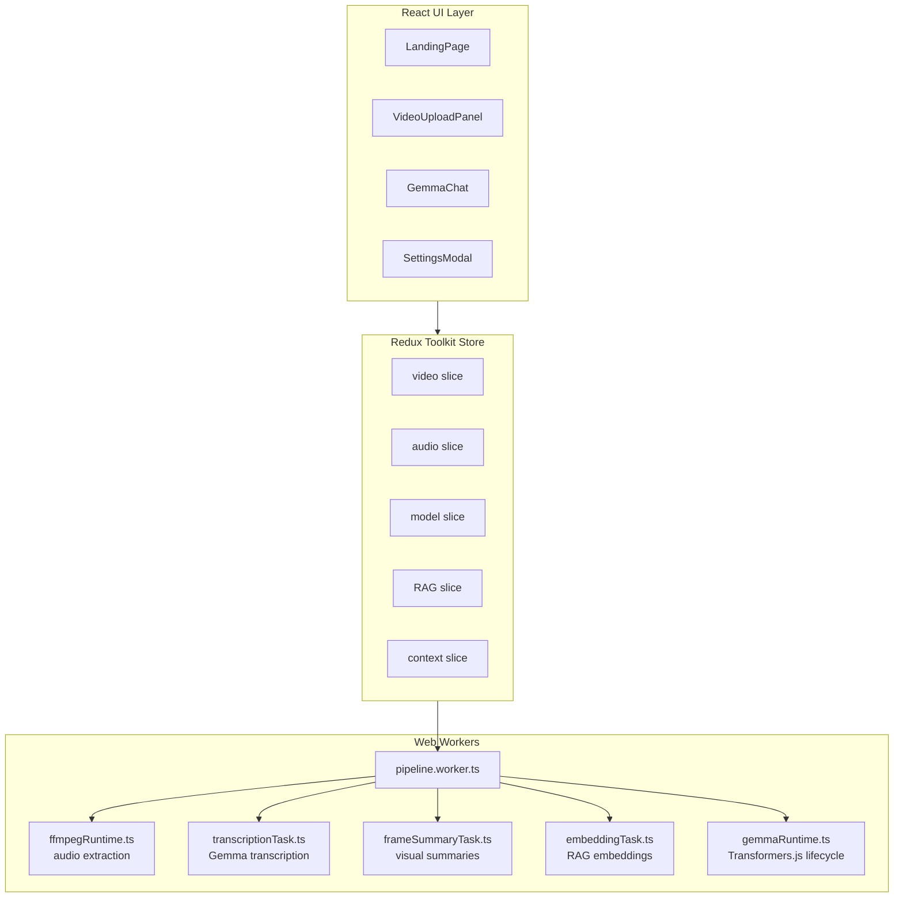

# VaultClip

<p align="center">
  
</p>

<p align="center">
  <strong>Private Video Q&A — 100% Local, 100% Browser</strong>
</p>

<p align="center">
  Upload any video and chat with it using local AI. No uploads. No servers. No data collection.
</p>

<p align="center">
  <a href="https://github.com/abhinav-TB/VaultClip"></a>
  <a href="https://github.com/abhinav-TB/VaultClip/actions"></a>
  
  
</p>

---

## Table of Contents

- [What is VaultClip?](#what-is-vaultclip)
- [Key Features](#key-features)
- [How It Works](#how-it-works)
- [Getting Started](#getting-started)
  - [Prerequisites](#prerequisites)
  - [Installation](#installation)
  - [Running Locally](#running-locally)
  - [Building for Production](#building-for-production)
- [Architecture](#architecture)
  - [High-Level Overview](#high-level-overview)
  - [Core Components](#core-components)
  - [Data Flow](#data-flow)
- [Tech Stack](#tech-stack)
- [Configuration](#configuration)
  - [Media Guardrails](#media-guardrails)
  - [Model Settings](#model-settings)
  - [Transcription Settings](#transcription-settings)
- [Deployment](#deployment)
- [Contributing](#contributing)
  - [Development Setup](#development-setup)
  - [Code Standards](#code-standards)
  - [Submitting Changes](#submitting-changes)
  - [Review Checklist](#review-checklist)
- [Troubleshooting](#troubleshooting)
- [Limitations](#limitations)
- [Security & Privacy](#security--privacy)
- [License](#license)
- [Acknowledgments](#acknowledgments)

---

## What is VaultClip?

VaultClip is an open-source, browser-only video analysis tool that lets you have natural conversations with any video or audio file. It uses local AI (Gemma via Transformers.js) to understand your media content and answer your questions — completely privately, with no data ever leaving your device.

### The Problem It Solves

- **Students** reviewing lecture recordings need quick answers without scrubbing through hours of video
- **Researchers** analyzing interview footage want searchable transcripts and instant Q&A
- **Professionals** going through meeting recordings need to extract key points efficiently
- **Content creators** reviewing their own footage need fast, private analysis

With VaultClip, you get all of this without:
- Creating an account
- Uploading files to external servers
- Paying for subscriptions
- Compromising your privacy

---

## Key Features

| Feature | Description |
|---------|-------------|
| 🔒 **100% Private** | All processing happens in your browser. Your videos never leave your device. |
| 🤖 **Local AI** | Powered by Gemma, running entirely in your browser via WebGPU. |
| 💬 **Conversational Q&A** | Ask questions in natural language and get answers with timestamps. |
| 📝 **Smart Transcripts** | Timestamped, searchable transcripts generated locally. |
| 📹 **Multi-Format Support** | Supports MP4, WebM, MOV, MP3, WAV, M4A, FLAC, and more. |
| ⚡ **Works Offline** | After initial model download, works completely offline. |
| 🚀 **Fast Inference** | Sub-second first-token latency with WebGPU acceleration. |
| 🔍 **Configurable** | Adjust media limits, audio settings, and transcription parameters. |

---

## How It Works

```
┌─────────────────────────────────────────────────────────────────────────────┐
│                           VaultClip Workflow                                 │
└─────────────────────────────────────────────────────────────────────────────┘

    ┌──────────┐      ┌──────────────┐      ┌─────────────────┐
    │  Upload  │ ───▶ │   Validate   │ ───▶ │     Preview     │
    │  Media   │      │  Guardrails  │      │   Media File    │
    └──────────┘      └──────────────┘      └────────┬────────┘
                                                     │
                                                     ▼
                   ┌─────────────────────────────────────────────────┐
                   │              Audio Extraction                   │
                   │         (ffmpeg.wasm in Web Worker)            │
                   └─────────────────────┬───────────────────────────┘
                                         │
                                         ▼
                   ┌─────────────────────────────────────────────────┐
                   │           Gemma Transcription                   │
                   │     (Transformers.js + WebGPU in Worker)       │
                   └─────────────────────┬───────────────────────────┘
                                         │
                                         ▼
                   ┌─────────────────────────────────────────────────┐
                   │          Timestamped Transcript                 │
                   │        + Chat-Ready Context Store              │
                   └─────────────────────┬───────────────────────────┘
                                         │
                                         ▼
                   ┌─────────────────────────────────────────────────┐
                   │              Local Q&A Chat                      │
                   │     (Gemma for generation, RAG for context)     │
                   └─────────────────────────────────────────────────┘
```

### Step-by-Step Process

1. **Upload** — Select any video or audio file from your computer
2. **Validate** — File is checked against configurable size and duration limits
3. **Preview** — Review the media before committing to processing
4. **Extract** — Audio is extracted using ffmpeg.wasm running in a Web Worker
5. **Transcribe** — Gemma processes audio in chunks to generate a timestamped transcript
6. **Chat** — Ask questions about the content and receive answers with source timestamps

---

## Getting Started

### Prerequisites

- **Browser**: Chrome, Edge, or any modern browser with WebGPU support
- **Hardware**: GPU with WebGPU support recommended for optimal performance
- **Network**: Required for initial model download (~1.5GB); afterward works offline

> **Note**: Firefox and Safari have partial WebGPU support. For the best experience, use Chrome or Edge.

### Installation

```bash
# Clone the repository
git clone https://github.com/abhinav-TB/VaultClip.git
cd VaultClip

# Install dependencies
npm install
```

### Running Locally

```bash
# Start the development server
npm run dev -- --host 127.0.0.1

# Run linting
npm run lint

# Run code standards check
npm run check:standards

# Run full verification (lint + standards + build)
npm run check
```

Open [http://127.0.0.1:5173](http://127.0.0.1:5173) in your browser.

### Building for Production

```bash
# Create an optimized production build
npm run build

# Preview the production build locally
npm run preview
```

---

## Architecture

### High-Level Overview

VaultClip is built as a modern single-page application with a clear separation between UI, state management, and compute-intensive workers.



### Core Components

| Component | Location | Purpose |
|-----------|----------|---------|
| `App.tsx` | `src/` | Root component, routing, settings management |
| `VideoUploadPanel.tsx` | `src/components/` | Media/session orchestration |
| `VideoUploadPanelSections.tsx` | `src/components/` | Presentational upload/audio/transcript UI |
| `GemmaChat.tsx` | `src/components/` | Local Gemma chat interface |
| `SettingsModal.tsx` | `src/components/` | Model, media, audio, transcript settings |
| `workerClient.ts` | `src/services/` | Promise-based worker communication facade |
| `videoFileRegistry.ts` | `src/lib/` | Non-serializable File object storage |
| `audioDataRegistry.ts` | `src/lib/` | Non-serializable audio byte storage |
| `gemmaRuntime.ts` | `src/workers/` | Transformers.js/Gemma lifecycle management |
| `ffmpegRuntime.ts` | `src/workers/` | Shared ffmpeg.wasm lifecycle |
| `transcriptionTask.ts` | `src/workers/` | Gemma transcription orchestration |
| `audioExtractionTask.ts` | `src/workers/` | Video-to-audio extraction |

### Data Flow

```
User selects media
        │
        ▼
┌───────────────────┐
│ videoFileRegistry │ (stores File object, NOT in Redux)
└───────────────────┘
        │
        ▼
┌───────────────────┐
│   Redux video     │ (stores metadata: name, size, duration, object URL)
│     slice         │
└───────────────────┘
        │
        ▼
┌───────────────────┐     ┌───────────────────┐
│  Web Worker       │────▶│  ffmpeg.wasm      │ (audio extraction)
│  pipeline.worker  │     └───────────────────┘
└───────────────────┘
        │
        ▼
┌───────────────────┐
│ audioDataRegistry │ (stores audio bytes, NOT in Redux)
└───────────────────┘
        │
        ▼
┌───────────────────┐     ┌───────────────────┐
│   Redux audio     │────▶│  Web Worker       │
│     slice         │     │  pipeline.worker  │
└───────────────────┘     └───────────────────┘
        │
        ▼
┌───────────────────┐
│   Gemma Runtime   │ (Transformers.js + WebGPU)
│  gemmaRuntime.ts  │
└───────────────────┘
        │
        ▼
┌───────────────────┐
│  Transcript with  │
│   Timestamps      │
└───────────────────┘
        │
        ▼
┌───────────────────┐     ┌───────────────────┐
│  RAG Embeddings   │────▶│  Chat Context     │
│  (local storage)  │     │  Preparation      │
└───────────────────┘     └───────────────────┘
        │
        ▼
┌───────────────────┐
│   User Chat UI    │
│   + Gemma Chat   │
└───────────────────┘
```

---

## Tech Stack

| Layer | Technology |
|-------|------------|
| **UI Framework** | React 18 with TypeScript |
| **Build Tool** | Vite 6 |
| **State Management** | Redux Toolkit |
| **Styling** | Tailwind CSS |
| **Routing** | React Router DOM 6 |
| **AI Runtime** | Transformers.js (`@huggingface/transformers`) |
| **Model** | Gemma 4 E2B Instruct ONNX (`onnx-community/gemma-4-E2B-it-ONNX`) |
| **Inference** | WebGPU |
| **Media Processing** | ffmpeg.wasm |
| **Code Quality** | ESLint, Prettier, TypeScript strict mode |
| **CI/CD** | GitHub Actions |
| **Deployment** | Cloudflare Workers with static assets |

---

## Configuration

### Media Guardrails

The settings modal controls processing constraints:

| Setting | Default | Description |
|---------|---------|-------------|
| Max video size | 100 MB | Maximum file size for video uploads |
| Max video duration | 10 min | Maximum duration for video processing |
| Audio format | WAV | Output format for audio extraction |
| Audio sample rate | 16,000 Hz | Target sample rate for transcription |

**Supported formats:**
- **Video**: MP4, WebM, Ogg, MOV
- **Audio**: MP3, WAV, M4A/AAC, FLAC, Ogg/Opus, WebM audio

### Model Settings

| Setting | Default | Description |
|---------|---------|-------------|
| Max new tokens (chat) | 128 | Maximum generation length for chat responses |
| Embedding model | all-MiniLM-L6-v2-ONNX | Model for RAG embeddings |
| Retrieval mode | hybrid | Hybrid semantic + keyword search |

### Transcription Settings

| Setting | Default | Description |
|---------|---------|-------------|
| Chunk length | 30 seconds | Audio chunk size (capped for coverage) |
| Chunk overlap | 0.1 seconds | Overlap between chunks |
| Max new tokens | 512 | Maximum tokens per transcript segment |
| Output | Unlimited | Maps to a large but finite generation cap |

---

## Deployment

VaultClip deploys on Cloudflare Workers with static assets. The Worker serves
the Vite build, provides SPA fallback for `/app`, and proxies Hugging Face model
files through `/hf/...` to avoid deployed-browser CORS failures.

```bash
# Build
npm run build

# Deploy to Cloudflare Workers
npx wrangler deploy
```

Pull request and branch preview deployments use:

```bash
npx wrangler versions upload
```

Deployment configuration lives in `wrangler.jsonc`.

---

## Contributing

We welcome contributions! Please read this guide before submitting changes.

### Development Setup

```bash
# Fork and clone the repository
git clone https://github.com/<your-username>/VaultClip.git
cd VaultClip

# Add upstream remote
git remote add upstream https://github.com/abhinav-TB/VaultClip.git

# Create a feature branch
git checkout -b feature/your-feature-name

# Install dependencies
npm install

# Make your changes, then verify
npm run check
```

### Code Standards

- **TypeScript Strict Mode** — `npm run check` must pass before merging
- **TSDoc Documentation** — Use `/** ... */` for exported functions, types, classes, and shared helpers when behavior or ownership is not obvious
- **Minimal Comments** — Use `//` only for implementation reasoning (cleanup behavior, browser limitations, retry logic)
- **File Size** — Avoid adding files that violate size limits (see `scripts/check-code-standards.mjs`)
- **No Suppressions** — Avoid `@ts-ignore`, blanket `eslint-disable`, and unresolved `TODO`/`FIXME`
- **Focused Files** — Split large files into focused components before they become hard to review

### Submitting Changes

1. **Fork** the repository and create your branch from `main`
2. **Write code** following the standards above
3. **Test** your changes thoroughly
4. **Verify** with `npm run check`
5. **Commit** using conventional commits (we enforce commitlint)
6. **Push** and open a Pull Request
7. **Await review** — we typically respond within 48 hours

### Review Checklist

Before requesting review, verify:

- [ ] Exported shared APIs are documented where future readers need context
- [ ] Large UI surfaces are split into focused components
- [ ] Browser resources (object URLs, ffmpeg files) are cleaned up
- [ ] Redux state remains serializable
- [ ] Worker messages are typed and routed through shared contracts
- [ ] Failure states surface actionable messages to the user
- [ ] `npm run check` passes

---

## Troubleshooting

### Model Won't Load

1. **Confirm WebGPU support** — Check `chrome://gpu` or `edge://gpu`
2. **Enable hardware acceleration** — Browser settings → System → "Use hardware acceleration when available"
3. **Check the UI status** — It shows: cache loading → network download → initialization → ready → failed
4. **Try reloading** — The model lifecycle restarts fresh on tab reload

### Audio Extraction Fails

1. **Try a shorter/smaller file** — Reduces memory pressure
2. **Verify browser preview** — If the browser can't play it, VaultClip can't process it
3. **Change output format** — Try WAV at 16 kHz for maximum compatibility

### Transcription Appears Incomplete

1. **Use 30-second chunks or smaller** — Longer chunks have shown incomplete coverage
2. **Increase transcript output tokens** — Allows more detailed transcription
3. **Adjust overlap** — Keep overlap small (0.1s) unless specific files need more

### Build Fails

1. **Clear node_modules and reinstall** — `rm -rf node_modules && npm install`
2. **Clear TypeScript cache** — `rm -f tsconfig.*.tsbuildinfo`
3. **Check Node version** — Requires Node 18+ (check `package.json` for `engines`)

---

## Limitations

- **Browser Memory** — Browser APIs do not expose reliable total system RAM or GPU memory usage
- **Timestamps** — Transcript timestamps are segment-level chunk ranges, not word-level alignment
- **Single Session** — MVP supports one active media session at a time
- **WebGPU** — Requires a browser with WebGPU support (Chrome/Edge recommended)
- **Model Download** — First-time use requires network access to download ~1.5GB of model files
- **Generation Caps** — "Unlimited" transcript output maps to a large but finite generation cap for browser inference

---

## Security & Privacy

### Our Commitment

| Principle | Implementation |
|-----------|----------------|
| **No Uploads** | Media files stay in browser memory via `File` API |
| **No External Servers** | All AI inference runs via WebGPU in the browser |
| **No Data Collection** | Zero analytics, tracking, or telemetry |
| **Open Source** | All code is auditable; model is publicly available on Hugging Face |
| **Local-First** | After initial model cache, works completely offline |

### Data Storage

- **Selected Media** — Stored in `videoFileRegistry` (in-memory, not persisted)
- **Extracted Audio** — Stored in `audioDataRegistry` (in-memory, not persisted)
- **Transcripts** — Held in Redux (serializable metadata only)
- **Preview URLs** — `blob:` object URLs revoked on cleanup
- **RAG Embeddings** — Generated fresh each session, not persisted

### No Backend

VaultClip has no backend, no API, and no server component. The only network requests are:
1. Initial model download from Hugging Face (~1.5GB, cached in browser)
2. Potential CDN requests for ffmpeg.wasm (if using external hosting)

---

## License

This project uses the MIT License. See the repository license metadata on
[GitHub](https://github.com/abhinav-TB/VaultClip).

---

## Acknowledgments

- **Google** — For releasing Gemma, the model powering VaultClip's AI capabilities
- **Hugging Face** — For Transformers.js, enabling in-browser ML inference
- **FFmpeg** — For the powerful audio/video processing library
- **Cloudflare** — For Workers, static assets, and R2-compatible hosting options
- **All Contributors** — For making VaultClip better with every contribution

---

<p align="center">
  <strong>Made with ❤️ for privacy-conscious video analysis</strong>
</p>

<p align="center">
  <a href="https://github.com/abhinav-TB/VaultClip">GitHub</a> •
  <a href="https://github.com/abhinav-TB/VaultClip/issues">Issues</a> •
  <a href="https://github.com/abhinav-TB/VaultClip/discussions">Discussions</a>
</p>
